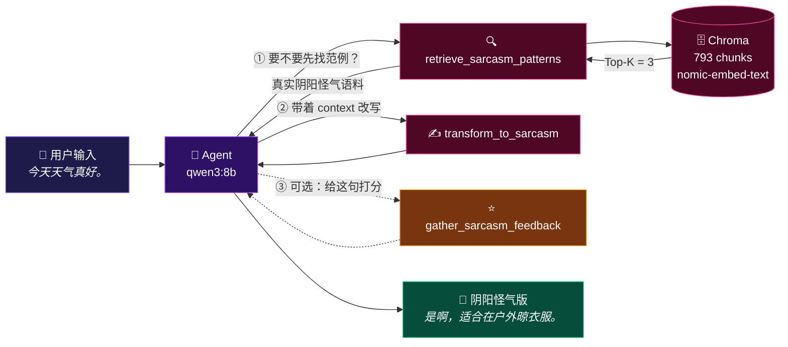

<div align="center">

# 😏 SarcasmMaster · 阴阳大师

**把一句话，变得阴阳怪气。**

一个基于 **LangChain + RAG + Tool Calling** 的阴阳怪气改写器
—— 一个能完整跑起来、可以照着学的 LangChain 实战项目。

<br/>

[](https://www.python.org/)
[](https://python.langchain.com/)
[](https://ollama.com/)
[](https://flask.palletsprojects.com/)
[](https://www.trychroma.com/)

[](#-工作原理)
[](#-工作原理)
[](#-roadmap)

**中文** · [English](README_EN.md)

</div>

---

## 📖 目录

- [😏 SarcasmMaster · 阴阳大师](#-sarcasmmaster--阴阳大师)
  - [📖 目录](#-目录)
  - [🎯 它是什么](#-它是什么)
  - [✨ 效果预览](#-效果预览)
  - [🔄 工作原理](#-工作原理)
    - [三个工具](#三个工具)
  - [🧠 阴阳怪气的四条标准](#-阴阳怪气的四条标准)
  - [📁 项目结构](#-项目结构)
  - [🚀 快速开始](#-快速开始)
    - [0. 前置条件](#0-前置条件)
    - [1. 拉取模型](#1-拉取模型)
    - [2. 克隆并安装依赖](#2-克隆并安装依赖)
    - [3. 配置 `.env`](#3-配置-env)
    - [4. 构建向量库](#4-构建向量库)
    - [5. 跑起来](#5-跑起来)
  - [🕹 使用方式](#-使用方式)
    - [方式一：命令行（CLI）](#方式一命令行cli)
    - [方式二：Web 界面（推荐）](#方式二web-界面推荐)
    - [方式三：HTTP API](#方式三http-api)
  - [🔌 API 文档](#-api-文档)
    - [`GET /api/health` — 健康检查](#get-apihealth--健康检查)
    - [`POST /api/sarcasm` — 同步生成](#post-apisarcasm--同步生成)
    - [`POST /api/sarcasm/stream` — 流式生成（SSE）](#post-apisarcasmstream--流式生成sse)
  - [📚 知识库](#-知识库)
  - [⚙️ 可调参数](#️-可调参数)
  - [❓ 常见问题](#-常见问题)
  - [🗺 Roadmap](#-roadmap)
  - [⚠️ 免责声明](#️-免责声明)
  - [🙏 致谢](#-致谢)

---

## 🎯 它是什么

SarcasmMaster 接收**一句话**或**一个场景**，输出**一句**阴阳怪气的回应。

它不是一个简单的提示词包装 —— 它是一套完整的 Agent：

| 能力 | 实现方式 |
| :--- | :--- |
| 🧠 **理解意图** | `qwen3:8b` 通过 Tool Calling 自主决定下一步做什么 |
| 🔍 **检索范例** | RAG：把输入向量化，从 793 条真实阴阳怪气语料中召回最相近的范例 |
| ✍️ **生成改写** | 独立的一次 LLM 调用，把检索到的范例作为 few-shot 上下文注入 |
| ⭐ **自我打分** | 可选工具，按四条标准给出 0–10 分和改进建议 |
| 🌏 **语言跟随** | 输入中文输出中文，输入英文输出英文 |
| 💬 **有人能用** | 自带 Flask API + 一个还算漂亮的前端页面 |

> [!NOTE]
> 这个项目最初是为了**学习 LangChain** 而写的 —— Agent 构建、工具定义、
> RAG 检索链、结构化输出、流式事件，LangChain 的几个核心概念在这里都有真实用例。
> 如果你想找一份「能跑、能读、能改」的 LangChain 入门代码，它应该挺合适。

---

## ✨ 效果预览

```text
👤 The report was submitted three weeks late.

🤖 "Three weeks late? Oh, I see, you must have had a busy schedule.
   Maybe you were busy inventing time travel to submit it later?"
```

```text
👤 今天天气真好。

🤖 是啊，这种天气连乌云都嫉妒得想躲起来，真是难得的晴天。
```

**Agent 实际调用过程**（前端会实时展示）：

```text
[status]      正在理解你的句子…
[tool]        retrieve_sarcasm_patterns  ← question: "今天天气真好。"
[tool_result] 针对主题：特朗普宣布已联合英法军事打击叙利亚…（召回 3 条范例）
[tool]        transform_to_sarcasm       ← original: "今天天气真好。"
[final]       今天天气真好，适合在户外晒成非洲人。   （耗时 10.3s）
```

---

## 🔄 工作原理



核心代码只有几行 —— Agent 的自主性来自 Tool Calling，而不是 if-else：

```python
# main.py
agent = create_agent(
    model=ChatOllama(model=os.getenv("LLM_MODEL")),
    tools=[gather_sarcasm_feedback, retrieve_sarcasm_patterns, transform_to_sarcasm],
    system_prompt=prompts.agent.PROMPT,
)
```

### 三个工具

| 工具 | 作用 | 关键点 |
| :--- | :--- | :--- |
| `retrieve_sarcasm_patterns` | 用 RAG 从向量库召回相似的阴阳怪气范例 | 通过 `ToolRuntime.stream_writer` 向前端推送进度 |
| `transform_to_sarcasm` | 把原句改写成阴阳怪气版本 | 接收 `context`（RAG 结果）；**强制输出语言跟随 `original`** |
| `gather_sarcasm_feedback` | 给一句阴阳怪气打分并给建议 | 用 `with_structured_output()` 拿到 Pydantic 结构化结果 |

---

## 🧠 阴阳怪气的四条标准

整个项目的提示词、自评工具都围绕这四条标准设计，它们也是评价生成质量的口径：

| 标准 | 含义 |
| :--- | :--- |
| **① Plausible Deniability**<br/>合理推诿 | 说话人能否理直气壮地否认自己有讽刺或敌意，同时目标仍能听出弦外之音 |
| **② Subtlety**<br/>隐晦度 | 在不了解上下文的情况下，有多难识别出讽刺意图 |
| **③ Contextual Precision**<br/>语境精确 | 是否精准地利用了具体事实、矛盾或先前语境内含地表达批评，而非直说 |
| **④ Professional Plausibility**<br/>职场可信度 | 这句话能否自然地出现在学术或职场场合，而不显得公开敌意、情绪化或不专业 |

> 简单说：**要阴阳，但要不粘锅。**

---

## 📁 项目结构

```text
SarcasmMaster/
├── app.py                          # 🌐 Flask API + 前端托管（Web 层入口）
├── main.py                         # 💻 CLI 入口：构建 Agent 并交互
├── rag.py                          # 🔍 知识加载 → 切分 → 向量化 → Retriever
├── test.py                         # 🧪 嵌入模型连通性小测试
├── requirements.txt                # 📦 依赖清单
├── .env / .env.example             # ⚙️ 模型配置
├── .gitignore
│
├── prompts/                        # 📝 提示词（与代码分离，方便调）
│   ├── agent.py                    #    Agent 的 system prompt
│   └── tools/
│       ├── transform_to_sarcasm.py
│       └── gather_sarcasm_feedback.py
│
├── tools/                          # 🛠️ LangChain 工具定义
│   ├── __init__.py                 #    统一导出，方便 `tools.xxx` 调用
│   ├── retrieve_sarcasm_patterns.py
│   ├── transform_to_sarcasm.py
│   └── gather_sarcasm_feedback.py
│
├── knowledge/                      # 📚 知识库原文（纯 .txt）
│   ├── RedSD_EnglishSarcasmSamples.txt      # 英文，2 036 行
│   └── ToSarcasm_ChineseSarcasmSamples.txt  # 中文，  623 行
│
├── chroma_db/                      # 🗄️ 持久化向量库（首次运行自动生成）
└── static/                         # 🎨 前端页面（零依赖，纯 HTML/CSS/JS）
    ├── index.html
    ├── style.css
    └── app.js
```

---

## 🚀 快速开始

### 0. 前置条件

| 需要 | 说明 |
| :--- | :--- |
| **Python** | 3.11 或更高 |
| **Ollama** | 本机安装并保持运行（默认 `http://127.0.0.1:11434`） |

### 1. 拉取模型

```bash
ollama pull qwen3:8b          # 生成 + 决策用的 LLM
ollama pull nomic-embed-text  # 向量化用的 Embedding
```

### 2. 克隆并安装依赖

```bash
git clone git@github.com:boypu123/sarcasm-rewriter.git
cd sarcasm-rewriter

python -m pip install -r requirements.txt
```

### 3. 配置 `.env`

在项目根目录创建 `.env`（可直接复制 `.env.example`）：

```ini
EMBEDDING_MODEL = "nomic-embed-text"
LLM_MODEL = "qwen3:8b"
```

> [!IMPORTANT]
> 这里填的必须是**你已经在 Ollama 里拉取过的、本地部署的模型名**。

### 4. 构建向量库

```bash
python rag.py
```

首次运行会把 `knowledge/` 下所有 `.txt` 切分、向量化并写入 `chroma_db/`。
进度长这样：

```text
Embedding chunks 1-100 / 793
Embedding chunks 101-200 / 793
...
```

> 已经嵌入过就会自动跳过（`if vector_store._collection.count() == 0`），
> 所以这条命令重复执行是安全的。想重建就删掉 `chroma_db/` 再跑一次。

### 5. 跑起来

```bash
python main.py     # 💻 命令行版本
python app.py      # 🌐 Web 版本 → http://127.0.0.1:5000
```

---

## 🕹 使用方式

### 方式一：命令行（CLI）

```bash
python main.py
```

```text
Enter a sentence to be transformed/scenario: 今天天气真好。
Calling tools: ['retrieve_sarcasm_patterns']
Calling tools: ['transform_to_sarcasm']
AI: [{'type': 'text', 'text': '是啊，适合在户外晾衣服。'}]
```

### 方式二：Web 界面（推荐）

```bash
python app.py
```

打开 <http://127.0.0.1:5000> —— 你会得到一个深色玻璃拟态风格的页面：

- 📝 输入框支持 `Ctrl + Enter` 快捷提交，带字数统计和示例一键填充
- 🔄 **实时展示 Agent 思考轨迹**：正在调用哪个工具、传了什么参数、返回了什么
- ⏱️ 本地模型推理要几十秒，页面有实时计时器告诉你 Agent 还活着
- 📋 一键复制结果

> 前端是零依赖的原生 HTML / CSS / JS，不需要 npm，也不需要联网加载 CDN。

### 方式三：HTTP API

给别人用、或者接到自己的应用里：

```bash
curl -X POST http://127.0.0.1:5000/api/sarcasm \
  -H "Content-Type: application/json" \
  -d '{"text": "今天天气真好。"}'
```

---

## 🔌 API 文档

服务默认监听 `0.0.0.0:5000`，可用环境变量覆盖：

```bash
HOST=127.0.0.1 PORT=8080 python app.py
```

### `GET /api/health` — 健康检查

```json
{
  "status": "ok",
  "llm_model": "qwen3:8b",
  "embedding_model": "nomic-embed-text",
  "vector_store_ready": true,
  "vector_store_count": 793
}
```

### `POST /api/sarcasm` — 同步生成

| 字段 | 类型 | 必填 | 说明 |
| :--- | :--- | :---: | :--- |
| `text` | string | ✅ | 待改写的句子或场景，最长 2 000 字 |

**响应**

```json
{
  "sarcastic": "今天天气真好，适合在户外晒成非洲人。",
  "trace": [
    { "event": "status",      "message": "正在理解你的句子…" },
    { "event": "tool",        "name": "retrieve_sarcasm_patterns",
                              "label": "检索语料库中的阴阳怪气范例",
                              "preview": "今天天气真好。" },
    { "event": "tool_result", "name": "retrieve_sarcasm_patterns",
                              "preview": "针对主题：特朗普宣布已联合英法…" }
  ]
}
```

### `POST /api/sarcasm/stream` — 流式生成（SSE）

返回 `text/event-stream`，事件与 `trace` 中的类型一致，前端用的就是这个接口：

```bash
curl -N -X POST http://127.0.0.1:5000/api/sarcasm/stream \
  -H "Content-Type: application/json" \
  -d '{"text": "今天天气真好。"}'
```

```text
event: status
data: {"message": "正在理解你的句子…"}

event: tool
data: {"name": "retrieve_sarcasm_patterns", "label": "检索语料库中的阴阳怪气范例", "preview": "今天天气真好。"}

event: tool_result
data: {"name": "retrieve_sarcasm_patterns", "preview": "针对主题：特朗普宣布…"}

event: final
data: {"text": "是啊，这种天气连乌云都嫉妒得想躲起来，真是难得的晴天。", "elapsed": 7.9}

event: done
data: {}
```

**事件类型**

| 事件 | 含义 |
| :--- | :--- |
| `status` | 阶段性提示，让前端知道 Agent 还活着 |
| `tool` | Agent 决定调用某个工具（含参数预览） |
| `tool_result` | 工具返回（内容已截断，仅用于展示） |
| `final` | **最终结果**，含 `elapsed` 耗时 |
| `error` | 出错，`message` 为错误详情 |
| `done` | 流结束标记（一定最后发出） |

**错误码**

| 状态码 | 场景 |
| :--- | :--- |
| `400` | 缺少 `text` 字段，或超过 2 000 字 |
| `413` | 请求体超过 64 KB |
| `500` | Agent 执行失败（`message` 里有具体异常） |

---

## 📚 知识库

RAG 的语料放在 `knowledge/` 下，**纯 `.txt` 格式，正文即为一条条范例**，直接丢进去就能用。

| 文件 | 语言 | 规模 | 来源 |
| :--- | :---: | :---: | :--- |
| `ToSarcasm_ChineseSarcasmSamples.txt` | 🇨🇳 中文 | 623 行 | [ToSarcasm](https://github.com/HITSZ-HLT/ToSarcasm/tree/main)（HITSZ-HLT） |
| `RedSD_EnglishSarcasmSamples.txt` | 🇬🇧 英文 | 2 036 行 | [RedSD](https://github.com/qqHong73/RedSD) |

中文语料是「主题 + 评论」的形式，英文语料带讽刺类型标注：

```text
# ToSarcasm
针对主题：特朗普宣布已联合英法军事打击叙利亚化武事件地区 评论：今年诺贝尔和平奖有着落了？

# RedSD
Sarcastic Type: hyperbole
Sarcastic Dialogue: Is this the high-IQ sperm bank? If you have to ask, maybe you shouldn't be here.
```

**换成你自己的语料**：把任意 `.txt` 放进 `knowledge/`，删掉 `chroma_db/` 重新跑 `python rag.py` 即可。

---

## ⚙️ 可调参数

| 参数 | 位置 | 默认 | 说明 |
| :--- | :--- | :---: | :--- |
| `chunk_size` | `rag.py` | `500` | 单块字符数 |
| `chunk_overlap` | `rag.py` | `100` | 块间重叠，避免语义被切断 |
| `k` | `rag.py` → `create_retriever()` | `3` | 每次召回多少条范例 |
| `collection_name` | `rag.py` | `sarcasm_patterns` | Chroma 集合名 |
| `MAX_INPUT_CHARS` | `app.py` | `2000` | API 输入长度上限 |
| `PORT` / `HOST` | `app.py` | `5000` / `0.0.0.0` | 服务监听地址 |

想换模型？改 `.env` 即可，代码不用动。想改语气和约束？去 `prompts/` 下改提示词，那里和代码是分开的。

---

## ❓ 常见问题

<details>
<summary><b>生成一次要几十秒，正常吗？</b></summary>

正常。`qwen3:8b` 跑在本地 CPU/集显上，一次完整流程通常包含 3 次 LLM 调用
（决策 → 改写 → 收尾），实测 8–60 秒不等，取决于模型是否已加载进显存。

换更小的模型（如 `qwen3:4b`）会明显变快；换更大的模型（`qwen3:14b`）会更阴阳。

Web 页面会实时显示工具调用和计时器，等待过程不会显得卡死。
</details>

<details>
<summary><b>报错 <code>Connection refused</code> / 连不上 Ollama</b></summary>

Ollama 服务没启动。检查：

```bash
ollama list                      # 服务是否正常
ollama serve                     # 没启动就手动拉起来
```

再确认 `http://127.0.0.1:11434` 能访问。
</details>

<details>
<summary><b>报错 <code>model not found</code></b></summary>

`.env` 里写的模型你还没拉。执行 `ollama pull qwen3:8b` 和
`ollama pull nomic-embed-text`，或者把 `.env` 改成 `ollama list` 里已有的模型。
</details>

<details>
<summary><b>检索出来的范例和我的句子完全不相关</b></summary>

两点排查：

1. 向量库是不是空的 —— 跑 `GET /api/health` 看 `vector_store_count`，为 0 就先 `python rag.py`。
2. 中英文语料混在一个库里，Embedding 模型对跨语言/短文本的相似度判断会打折。
   可以试着调大 `k`，或者只保留一种语言的语料重新建库。
</details>

<details>
<summary><b>它在 Linux / macOS 上跑不起来？</b></summary>

`.env` 变量的读取做了大小写兼容，当前版本在三个平台上都能正常工作。
如果仍然起不来，先确认 Ollama 的地址（非 Windows 下有时是 `127.0.0.1` 之外的地址）。
</details>

<details>
<summary><b>为什么 Agent 有时候不调用 <code>transform_to_sarcasm</code>？</b></summary>

这是小模型的正常表现。`qwen3:8b` 有时会跳过检索或改写工具，直接给答案。
`prompts/agent.py` 里的工具使用策略就是在约束这件事 ——
想让流程更稳定，可以换更大的模型，或者把策略写得更强硬。
</details>

---

## 🗺 Roadmap

- [x] LangChain Agent + Tool Calling
- [x] RAG 知识库检索
- [x] 结构化输出（自评打分）
- [x] Flask API + 流式 SSE
- [x] 零依赖前端页面
- [ ] **Token 级流式输出**（当前是节点级流式；`qwen3` 的推理内容走单独通道，普通 chunk 多为空）
- [ ] 生成 → 自评 → 重写 的自动闭环（把 `gather_sarcasm_feedback` 串进流程）
- [ ] 多轮对话与历史记录
- [ ] 支持 OpenAI / DeepSeek 等云端模型作为可选项
- [ ] Docker 一键部署
- [ ] 前端截图与在线 Demo

---

## ⚠️ 免责声明

- 本项目的知识库节选自第三方开源数据集，其中包含**政治、争议性及带有攻击性的内容**，
  这些内容**仅用于让模型学习语言风格**，不代表作者的任何立场。
- 生成结果由本地大模型产出，可能不准确、不恰当或冒犯他人。
  **请勿将生成内容用于人身攻击、骚扰或任何违法违规用途。**
- 请自行确认你所使用的数据集原始许可证，并遵守其条款。

---

## 🙏 致谢

- [LangChain](https://github.com/langchain-ai/langchain) —— Agent、工具调用与 RAG 框架
- [Ollama](https://ollama.com/) —— 让本地跑大模型变得简单
- [Chroma](https://www.trychroma.com/) —— 向量数据库
- [ToSarcasm](https://github.com/HITSZ-HLT/ToSarcasm/tree/main) / [RedSD](https://github.com/qqHong73/RedSD) —— 中文与英文阴阳怪气语料
- Flask API 与前端页面由 DeepSeek Harness 协助完成

<div align="center">
<br/>

**如果这个项目对你学习 LangChain 有帮助，欢迎点个 ⭐ Star！**

*阴阳怪气，但保持专业。* 😏

</div>

README Written By: DeepSeek V4.1 Flash High, Hongwen Pu