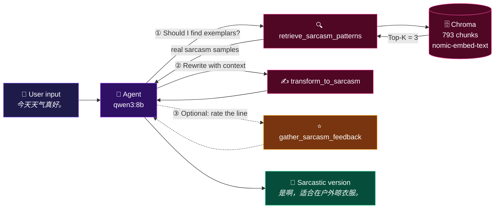

<div align="center">

# 😏 SarcasmMaster

**Turn a plain sentence into something politely savage.**

A sarcasm rewriter built on **LangChain + RAG + Tool Calling**
— a complete, runnable LangChain project you can actually learn from.

<br/>

[](https://www.python.org/)
[](https://python.langchain.com/)
[](https://ollama.com/)
[](https://flask.palletsprojects.com/)
[](https://www.trychroma.com/)

[](#-how-it-works)
[](#-how-it-works)
[](#-roadmap)

[中文](README.md) · **English**

</div>

---

## 📖 Table of Contents

- [😏 SarcasmMaster](#-sarcasmmaster)
  - [📖 Table of Contents](#-table-of-contents)
  - [🎯 What It Is](#-what-it-is)
  - [✨ Preview](#-preview)
  - [🔄 How It Works](#-how-it-works)
    - [The three tools](#the-three-tools)
  - [🧠 The Four Criteria of Sarcasm](#-the-four-criteria-of-sarcasm)
  - [📁 Project Structure](#-project-structure)
  - [🚀 Quick Start](#-quick-start)
    - [0. Prerequisites](#0-prerequisites)
    - [1. Pull the models](#1-pull-the-models)
    - [2. Clone and install](#2-clone-and-install)
    - [3. Configure `.env`](#3-configure-env)
    - [4. Build the vector store](#4-build-the-vector-store)
    - [5. Run it](#5-run-it)
  - [🕹 Usage](#-usage)
    - [Option 1: Command Line (CLI)](#option-1-command-line-cli)
    - [Option 2: Web UI (recommended)](#option-2-web-ui-recommended)
    - [Option 3: HTTP API](#option-3-http-api)
  - [🔌 API Reference](#-api-reference)
    - [`GET /api/health` — health check](#get-apihealth--health-check)
    - [`POST /api/sarcasm` — synchronous](#post-apisarcasm--synchronous)
    - [`POST /api/sarcasm/stream` — streaming (SSE)](#post-apisarcasmstream--streaming-sse)
  - [📚 Knowledge Base](#-knowledge-base)
  - [⚙️ Tuning](#️-tuning)
  - [❓ FAQ](#-faq)
  - [🗺 Roadmap](#-roadmap)
  - [⚠️ Disclaimer](#️-disclaimer)
  - [🙏 Credits](#-credits)

---

## 🎯 What It Is

SarcasmMaster takes **one sentence** or **one scenario** and returns **one line** of sarcastic commentary.

It is not a thin prompt wrapper — it is a full agent:

| Capability | How it's done |
| :--- | :--- |
| 🧠 **Understands intent** | `qwen3:8b` decides the next step by itself via Tool Calling |
| 🔍 **Retrieves exemplars** | RAG: embeds the input and recalls the closest patterns from 793 real sarcasm samples |
| ✍️ **Rewrites** | A separate LLM call that injects the retrieved samples as few-shot context |
| ⭐ **Self-scores** | Optional tool that rates the output against four criteria and suggests improvements |
| 🌏 **Follows language** | Chinese in, Chinese out; English in, English out |
| 💬 **Usable by others** | Ships with a Flask API and a reasonably attractive frontend |

> [!NOTE]
> This project started as a way to **learn LangChain** — agent construction, tool
> definition, retrieval chains, structured output and streaming events all appear
> here in real use. If you are looking for "runnable, readable, hackable"
> LangChain starter code, this should fit.

---

## ✨ Preview

```text
👤 The report was submitted three weeks late.

🤖 "Three weeks late? Oh, I see, you must have had a busy schedule.
   Maybe you were busy inventing time travel to submit it later?"
```

```text
👤 今天天气真好。

🤖 是啊，这种天气连乌云都嫉妒得想躲起来，真是难得的晴天。
```

**What the agent actually does** (the frontend shows this live):

```text
[status]      正在理解你的句子…
[tool]        retrieve_sarcasm_patterns  ← question: "今天天气真好。"
[tool_result] 针对主题：特朗普宣布已联合英法军事打击叙利亚… (3 exemplars recalled)
[tool]        transform_to_sarcasm       ← original: "今天天气真好。"
[final]       是啊，这种天气连乌云都嫉妒得想躲起来，真是难得的晴天。   (10.3s)
```

---

## 🔄 How It Works



The core is just a few lines — the agent's autonomy comes from Tool Calling, not from if-else:

```python
# main.py
agent = create_agent(
    model=ChatOllama(model=os.getenv("LLM_MODEL")),
    tools=[gather_sarcasm_feedback, retrieve_sarcasm_patterns, transform_to_sarcasm],
    system_prompt=prompts.agent.PROMPT,
)
```

### The three tools

| Tool | Purpose | Key detail |
| :--- | :--- | :--- |
| `retrieve_sarcasm_patterns` | RAG recall of similar sarcasm exemplars | Pushes progress to the frontend via `ToolRuntime.stream_writer` |
| `transform_to_sarcasm` | Rewrites the original sentence | Takes `context` (the RAG output); **output language is forced to follow `original`** |
| `gather_sarcasm_feedback` | Rates a line and suggests improvements | Uses `with_structured_output()` for a Pydantic result |

---

## 🧠 The Four Criteria of Sarcasm

The prompts and the self-scoring tool are all built around these four criteria —
they are also the rubric for judging output quality:

| Criterion | Meaning |
| :--- | :--- |
| **① Plausible Deniability** | The speaker could sincerely deny any sarcasm or hostility, while the target still hears the subtext |
| **② Subtlety** | How hard it is to detect the sarcastic intent without knowing the context |
| **③ Contextual Precision** | Whether it leverages specific facts, contradictions or prior context to imply criticism rather than stating it outright |
| **④ Professional Plausibility** | Whether the line could appear naturally in an academic or workplace setting without reading as openly hostile, emotional or unprofessional |

> In short: **be savage, but stay non-stick.**

---

## 📁 Project Structure

```text
SarcasmMaster/
├── app.py                          # 🌐 Flask API + frontend hosting (web entry point)
├── main.py                         # 💻 CLI entry point: builds the agent, then chats
├── rag.py                          # 🔍 load → split → embed → retriever
├── test.py                         # 🧪 small embedding-model connectivity check
├── requirements.txt                # 📦 dependencies
├── .env / .env.example             # ⚙️ model configuration
├── .gitignore
│
├── prompts/                        # 📝 prompts (kept out of code, easy to tune)
│   ├── agent.py                    #    the agent's system prompt
│   └── tools/
│       ├── transform_to_sarcasm.py
│       └── gather_sarcasm_feedback.py
│
├── tools/                          # 🛠️ LangChain tool definitions
│   ├── __init__.py                 #    re-exports, so you can call `tools.xxx`
│   ├── retrieve_sarcasm_patterns.py
│   ├── transform_to_sarcasm.py
│   └── gather_sarcasm_feedback.py
│
├── knowledge/                      # 📚 raw corpus (plain .txt)
│   ├── RedSD_EnglishSarcasmSamples.txt      # English, 2,036 lines
│   └── ToSarcasm_ChineseSarcasmSamples.txt  # Chinese,   623 lines
│
├── chroma_db/                      # 🗄️ persisted vector store (auto-generated on first run)
└── static/                         # 🎨 frontend (zero dependencies, plain HTML/CSS/JS)
    ├── index.html
    ├── style.css
    └── app.js
```

---

## 🚀 Quick Start

### 0. Prerequisites

| Requirement | Notes |
| :--- | :--- |
| **Python** | 3.11 or newer |
| **Ollama** | Installed and running locally (default `http://127.0.0.1:11434`) |

### 1. Pull the models

```bash
ollama pull qwen3:8b          # the LLM for reasoning + generation
ollama pull nomic-embed-text  # the embedding model for RAG
```

### 2. Clone and install

```bash
git clone git@github.com:boypu123/sarcasm-rewriter.git
cd sarcasm-rewriter

python -m pip install -r requirements.txt
```

### 3. Configure `.env`

Create `.env` in the project root (or just copy `.env.example`):

```ini
EMBEDDING_MODEL = "nomic-embed-text"
LLM_MODEL = "qwen3:8b"
```

> [!IMPORTANT]
> The names here must match models you have **already pulled into Ollama**
> and are running **locally**.

### 4. Build the vector store

```bash
python rag.py
```

On first run this splits, embeds and persists every `.txt` under `knowledge/`
into `chroma_db/`. Progress looks like this:

```text
Embedding chunks 1-100 / 793
Embedding chunks 101-200 / 793
...
```

> If the store is already populated it is skipped
> (`if vector_store._collection.count() == 0`), so re-running is safe.
> To rebuild from scratch, delete `chroma_db/` and run it again.

### 5. Run it

```bash
python main.py     # 💻 command line
python app.py      # 🌐 web version → http://127.0.0.1:5000
```

---

## 🕹 Usage

### Option 1: Command Line (CLI)

```bash
python main.py
```

```text
Enter a sentence to be transformed/scenario: 今天天气真好。
Calling tools: ['retrieve_sarcasm_patterns']
Calling tools: ['transform_to_sarcasm']
AI: [{'type': 'text', 'text': '是啊，适合在户外晾衣服。'}]
```

### Option 2: Web UI (recommended)

```bash
python app.py
```

Open <http://127.0.0.1:5000> — you get a dark, glassmorphic page:

- 📝 `Ctrl + Enter` to submit, a character counter, and one-click sample prompts
- 🔄 **Live agent trace**: which tool is running, what arguments it got, what came back
- ⏱️ Local inference takes tens of seconds; a live timer shows the agent is still alive
- 📋 One-click copy of the result

> The frontend is dependency-free vanilla HTML / CSS / JS — no npm, no CDN, no internet required.

### Option 3: HTTP API

For other people, or for wiring into your own app:

```bash
curl -X POST http://127.0.0.1:5000/api/sarcasm \
  -H "Content-Type: application/json" \
  -d '{"text": "今天天气真好。"}'
```

---

## 🔌 API Reference

The server listens on `0.0.0.0:5000` by default; override with environment variables:

```bash
HOST=127.0.0.1 PORT=8080 python app.py
```

### `GET /api/health` — health check

```json
{
  "status": "ok",
  "llm_model": "qwen3:8b",
  "embedding_model": "nomic-embed-text",
  "vector_store_ready": true,
  "vector_store_count": 793
}
```

### `POST /api/sarcasm` — synchronous

| Field | Type | Required | Notes |
| :--- | :--- | :---: | :--- |
| `text` | string | ✅ | Sentence or scenario to rewrite, max 2,000 characters |

**Response**

```json
{
  "sarcastic": "今天天气真好，适合在户外晒成非洲人。",
  "trace": [
    { "event": "status",      "message": "正在理解你的句子…" },
    { "event": "tool",        "name": "retrieve_sarcasm_patterns",
                              "label": "检索语料库中的阴阳怪气范例",
                              "preview": "今天天气真好。" },
    { "event": "tool_result", "name": "retrieve_sarcasm_patterns",
                              "preview": "针对主题：特朗普宣布已联合英法…" }
  ]
}
```

### `POST /api/sarcasm/stream` — streaming (SSE)

Returns `text/event-stream` with the same event types as `trace`.
This is what the frontend uses:

```bash
curl -N -X POST http://127.0.0.1:5000/api/sarcasm/stream \
  -H "Content-Type: application/json" \
  -d '{"text": "今天天气真好。"}'
```

```text
event: status
data: {"message": "正在理解你的句子…"}

event: tool
data: {"name": "retrieve_sarcasm_patterns", "label": "检索语料库中的阴阳怪气范例", "preview": "今天天气真好。"}

event: tool_result
data: {"name": "retrieve_sarcasm_patterns", "preview": "针对主题：特朗普宣布…"}

event: final
data: {"text": "是啊，这种天气连乌云都嫉妒得想躲起来，真是难得的晴天。", "elapsed": 7.9}

event: done
data: {}
```

**Event types**

| Event | Meaning |
| :--- | :--- |
| `status` | Progress hint so the frontend knows the agent is alive |
| `tool` | The agent decided to call a tool (with an argument preview) |
| `tool_result` | Tool returned (truncated, for display only) |
| `final` | **The result**, with `elapsed` in seconds |
| `error` | Something failed; `message` holds the detail |
| `done` | End-of-stream marker (always sent last) |

**Error codes**

| Status | When |
| :--- | :--- |
| `400` | Missing `text`, or longer than 2,000 characters |
| `413` | Request body larger than 64 KB |
| `500` | Agent execution failed (`message` carries the exception) |

---

## 📚 Knowledge Base

The RAG corpus lives in `knowledge/` as **plain `.txt` files — the body text is the
exemplars**, so you can drop in your own.

| File | Language | Size | Source |
| :--- | :---: | :---: | :--- |
| `ToSarcasm_ChineseSarcasmSamples.txt` | 🇨🇳 Chinese | 623 lines | [ToSarcasm](https://github.com/HITSZ-HLT/ToSarcasm/tree/main) (HITSZ-HLT) |
| `RedSD_EnglishSarcasmSamples.txt` | 🇬🇧 English | 2,036 lines | [RedSD](https://github.com/qqHong73/RedSD) |

The Chinese corpus is "topic + comment"; the English corpus is labelled by sarcasm type:

```text
# ToSarcasm
针对主题：特朗普宣布已联合英法军事打击叙利亚化武事件地区 评论：今年诺贝尔和平奖有着落了？

# RedSD
Sarcastic Type: hyperbole
Sarcastic Dialogue: Is this the high-IQ sperm bank? If you have to ask, maybe you shouldn't be here.
```

**Using your own corpus**: drop any `.txt` into `knowledge/`, delete `chroma_db/`,
and re-run `python rag.py`.

---

## ⚙️ Tuning

| Parameter | Where | Default | Notes |
| :--- | :--- | :---: | :--- |
| `chunk_size` | `rag.py` | `500` | Characters per chunk |
| `chunk_overlap` | `rag.py` | `100` | Overlap between chunks so meaning isn't cut in half |
| `k` | `rag.py` → `create_retriever()` | `3` | How many exemplars to recall |
| `collection_name` | `rag.py` | `sarcasm_patterns` | Chroma collection name |
| `MAX_INPUT_CHARS` | `app.py` | `2000` | API input length limit |
| `PORT` / `HOST` | `app.py` | `5000` / `0.0.0.0` | Where the server listens |

Swapping models is a `.env` change — no code edits. To change tone or constraints,
edit the prompts under `prompts/`, which are kept separate from the code.

---

## ❓ FAQ

<details>
<summary><b>It takes tens of seconds per generation. Is that normal?</b></summary>

Yes. `qwen3:8b` runs locally on CPU / integrated graphics, and one full pass
usually involves three LLM calls (decide → rewrite → wrap up). Measured times
range from 8 to 60 seconds, depending on whether the model is already loaded
into memory.

Switching to a smaller model (e.g. `qwen3:4b`) is noticeably faster; going larger
(`qwen3:14b`) produces sharper sarcasm.

The web page shows live tool calls and a timer, so the wait never looks frozen.
</details>

<details>
<summary><b><code>Connection refused</code> / can't reach Ollama</b></summary>

The Ollama service isn't running. Check:

```bash
ollama list                      # is the service up?
ollama serve                     # start it manually if not
```

Then confirm `http://127.0.0.1:11434` responds.
</details>

<details>
<summary><b><code>model not found</code></b></summary>

You haven't pulled the model named in `.env`. Run `ollama pull qwen3:8b` and
`ollama pull nomic-embed-text`, or point `.env` at a model already in `ollama list`.
</details>

<details>
<summary><b>The retrieved exemplars are completely unrelated to my sentence</b></summary>

Two things to check:

1. Is the vector store empty? Hit `GET /api/health` and look at
   `vector_store_count`; if it's 0, run `python rag.py` first.
2. Chinese and English corpora share one collection, and embedding models are
   weaker at cross-lingual / very short-text similarity. Try raising `k`, or keep
   one language and rebuild the store.
</details>

<details>
<summary><b>It won't run on Linux / macOS?</b></summary>

Reading of the `.env` variables is case-insensitive, and the current version works
on all three platforms. If it still won't start, check the Ollama address (on
non-Windows systems it is sometimes not `127.0.0.1`).
</details>

<details>
<summary><b>Why does the agent sometimes skip <code>transform_to_sarcasm</code>?</b></summary>

That's normal behaviour for a small model. `qwen3:8b` occasionally skips retrieval
or the rewrite tool and answers directly. The tool-usage policy in
`prompts/agent.py` exists to constrain exactly this. For a more consistent flow,
use a larger model or make the policy stricter.
</details>

---

## 🗺 Roadmap

- [x] LangChain agent + Tool Calling
- [x] RAG knowledge retrieval
- [x] Structured output (self-scoring)
- [x] Flask API + SSE streaming
- [x] Dependency-free frontend
- [ ] **Token-level streaming** (currently node-level; `qwen3` reasons on a separate channel, so plain chunks are mostly empty)
- [ ] Automatic generate → self-score → rewrite loop (wiring `gather_sarcasm_feedback` into the flow)
- [ ] Multi-turn conversation and history
- [ ] Optional cloud models (OpenAI / DeepSeek)
- [ ] One-command Docker deployment
- [ ] Frontend screenshots and a live demo

---

## ⚠️ Disclaimer

- The knowledge base is excerpted from third-party open datasets and contains
  **political, controversial and offensive material**. It is included **only so the
  model can learn a linguistic style**, and does not represent the author's views.
- Output is produced by a local LLM and may be inaccurate, inappropriate or
  offensive. **Do not use it for personal attacks, harassment, or anything illegal.**
- Please check the original licences of the datasets you use and comply with them.

---

## 🙏 Credits

- [LangChain](https://github.com/langchain-ai/langchain) — agents, tool calling and RAG
- [Ollama](https://ollama.com/) — running LLMs locally without pain
- [Chroma](https://www.trychroma.com/) — the vector database
- [ToSarcasm](https://github.com/HITSZ-HLT/ToSarcasm/tree/main) / [RedSD](https://github.com/qqHong73/RedSD) — Chinese and English sarcasm corpora
- The Flask API and frontend were built with help from DeepSeek Harness

<div align="center">
<br/>

**If this project helped you learn LangChain, a ⭐ Star would be appreciated!**

*Sarcastic, but professional.* 😏

</div>

README Written By: DeepSeek V4.1 Flash High, Hongwen Pu